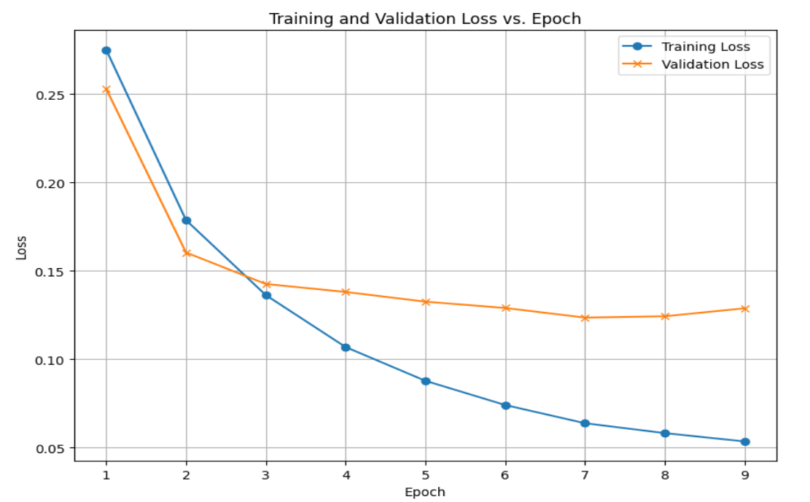

# JobVacanciesNLP
NLP course projec. Main idea was to train Named Entity Recognition model that would help in analysis of 
Tech(IT) Job Vacancies. Repo contains data scraping, prcessing and model training code;  

### Authors
- [Dmytro Strus](https://github.com/Baredal)
- [Ustym Hentosh](https://github.com/ustymhentosh)

### Instruction

**Local Deployment**

To run example application locally:
- have `python 3.12` insatlled
- run `pip install src\app\requirements.txt`
- run `python src\app\app_gradio.py`

Aplication will be running on localhost [127.0.0.1:7860](http://127.0.0.1:7860/)

**Huggingface Space**

Alternatively we have NER model deployed on public HF space, you can visit and test yourself - https://huggingface.co/spaces/Darebal/vacancies_ner

### Contents

**`data/`**
- `/dicts` — dictionaries of links to vacancies aquired by scraping.
- `/texts` — original markdown job vacancies files from all `dicts` links.
- `/annotated_manual` — first batch of manualy annotated data.
- `/annotated_gliner` — first batch of Python and ML annotated data with small GliNER model.
- `/texts_ner` — only english language vacancies from `/texts` folder
- `texts_ner_cleaned_one_line/` — two folders of cleaned text in single-line format.
- `texts_ner_cleaned_standard/` — final cleaned NER texts with preserved paragraphs used for downstream training.
- `cleaned_standard_annotated` — annotated data from `texts_ner_cleaned_standard/` by GliNER bigger model.
- `spacy` — exported spaCy .spacy binary datasets: train.spacy, dev.spacy, test.spacy.

**`src/`**
- `app/`
    - `app_gradio.py` — Gradio demo app to run inference / visualize NER.
- `data_transformations/`
    - `scrping.ipynb` — scraping / data collection.
    - `ner_prepare.ipynb` — english detection, `.md` to `.txt`.
    - `clean_text.ipynb` — notebook for text cleaning.
    - `ner_labeling.ipynb` — labeling workflow.
- `training/`
    - `base_model/` - baseline model
    - `hf_transformer_model/` - Hugging Face transformer-based final NER model
    - `spacy_model/` - spaCy training model

### Results

Achieved f1-score of **0.86** by finetunning `microsoft/deberta-v3-base` on ~500 examples

| Epoch | Training Loss | Validation Loss | Precision | Recall | F1 |
|------:|--------------:|----------------:|----------:|-------:|----:|
| 1 | 0.275000 | 0.252856 | 0.584799 | 0.726611 | 0.648037 |
| 2 | 0.178600 | 0.160281 | 0.771754 | 0.782996 | 0.777334 |
| 3 | 0.136200 | 0.142473 | 0.803433 | 0.805350 | 0.804390 |
| 4 | 0.106800 | 0.137975 | 0.829707 | 0.833354 | 0.831527 |
| 5 | 0.087700 | 0.132469 | 0.817008 | 0.857843 | 0.836927 |
| 6 | 0.074000 | 0.128900 | 0.825789 | 0.863745 | 0.844341 |
| 7 | 0.063700 | 0.123461 | 0.850019 | 0.864749 | 0.857321 |
| 8 | 0.058100 | 0.124204 | 0.858278 | 0.867763 | 0.862995 |
| 9 | 0.053400 | 0.128713 | 0.849412 | 0.871280 | 0.860207 |

Link to Model Weights https://huggingface.co/Darebal/vacancies_ner

### References
- DOU - https://jobs.dou.ua/ 
- GliNER - https://github.com/fastino-ai/GLiNER2/tree/main
- NLP Course - https://github.com/robinhad/ucu-nlp-course
- manual NER annotator - https://arunmozhi.in/ner-annotator/
- default blank spacy model - https://drive.google.com/drive/folders/1oLaQw6wyAVL6PLX0NASEY21eCpIgosi0?usp=sharing
- transformer spacy model - https://drive.google.com/drive/folders/1BbCNR49DU93Ghjm6MeimRzmSw4_Ztv9L?usp=sharing
